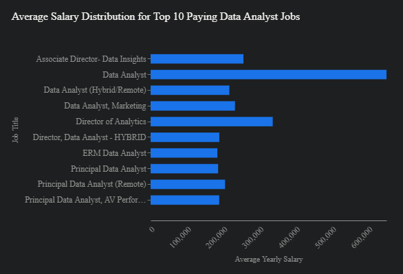
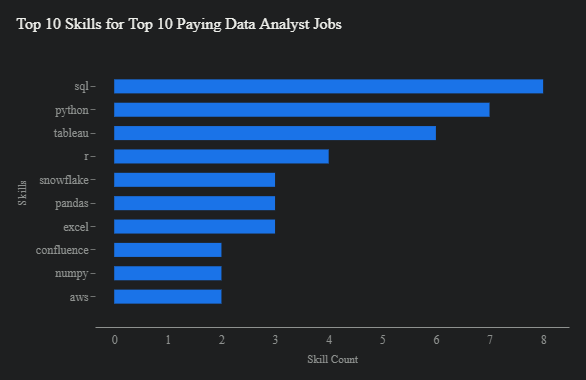

# Introduction

In this project, we embark on a journey through the data analyst job market. We'll uncover the most lucrative roles, spotlight the skills that employers crave, and reveal where the sweet spot lies between high demand and top salaries. The raw data fueling this exploration comes from my SQL Course, and the SQL queries I used are available in the [project_sql folder](/project_sql/).

# Background

My motivation for this project was simple: to navigate the data analyst job market more effectively. I wanted to equip myself and others with knowledge about the most sought-after skills and the best-paying positions.  To achieve this, I used SQL to address these questions:

1. Which data analyst jobs offer the highest salaries?
2. What skills are essential for landing those top-paying roles?
3. Which skills are in highest demand across the board?
4. What's the correlation between specific skills and salary levels?
5. Which skills offer the optimal blend of demand and earning potential?

# Tools I used

My analysis relied on the following tools:

- **SQL:** The cornerstone for querying the job posting database.
- **PostgreSQL:** The database management system housing the data.
- **Visual Studio** Code: My environment for managing the database and executing queries.
- **Git & GitHub:** Ensuring version control and collaboration for my scripts and analysis.

# The Analysis

Each SQL query targeted a specific facet of the job market. Let's delve into the findings:

### 1.The Elite: Top-Paying Data Analyst Jobs
By filtering for remote data analyst positions with the highest average salaries, we found a range spanning $184,000 to $650,000 annually.  This diversity in salaries is a testament to the varied roles and specializations within data analytics. Companies like SmartAsset, Meta, and AT&T are among those leading the way in compensation.

```sql
SELECT 
    job_id,
    job_title,
    job_location,
    job_schedule_type,
    salary_year_avg,
    name AS company_name,
    job_posted_date
FROM
    job_postings_fact 
LEFT JOIN
    company_dim ON job_postings_fact.company_id = company_dim.company_id
WHERE
    job_title_short = 'Data Analyst' AND
    job_location = 'Anywhere' AND
    salary_year_avg IS NOT NULL
ORDER BY 
    salary_year_avg DESC
LIMIT 10;
```



*Bar graph visualizing the salary for the top 10 salaries for data analysts;  Google Gemini generated this graph from my SQL query results*

### 2.Skills That Unlock Top Salaries
Analyzing the skills required for these elite positions, we see SQL reigning supreme, with Python and Tableau following closely behind.  Other sought-after skills include R, Snowflake, Pandas, and Excel.

```sql
WITH top_paying_jobs AS (
    SELECT	
        job_id,
        job_title,
        salary_year_avg,
        name AS company_name
    FROM
        job_postings_fact
    LEFT JOIN company_dim ON job_postings_fact.company_id = company_dim.company_id
    WHERE
        job_title_short = 'Data Analyst' AND 
        job_location = 'Anywhere' AND 
        salary_year_avg IS NOT NULL
    ORDER BY
        salary_year_avg DESC
    LIMIT 10
)

SELECT 
    top_paying_jobs.*,
    skills
FROM top_paying_jobs
INNER JOIN skills_job_dim ON top_paying_jobs.job_id = skills_job_dim.job_id
INNER JOIN skills_dim ON skills_job_dim.skill_id = skills_dim.skill_id
ORDER BY
    salary_year_avg DESC;
```


*Bar graph visualizing the count of skills for the top 10 paying jobs for data analysts; Google Gemini generated this graph from my SQL query results*

### 3.In-Demand Skills Across the Board
Zooming out to the broader market, SQL and Excel remain foundational.  However, the demand for programming languages like Python and visualization tools like Tableau and Power BI is also significant, highlighting the growing need for technical prowess.

```sql
SELECT 
    skills,
    COUNT(skills_job_dim.job_id) AS demand_count
FROM job_postings_fact
INNER JOIN skills_job_dim ON job_postings_fact.job_id = skills_job_dim.job_id
INNER JOIN skills_dim ON skills_job_dim.skill_id = skills_dim.skill_id
WHERE
    job_title_short = 'Data Analyst'
GROUP BY
    skills
ORDER BY demand_count DESC
LIMIT 5
```

| Skill    | Demand Count |
|----------|--------------|
| SQL      | 92,628       |
| Excel    | 67,031       |
| Python   | 57,326       |
| Tableau  | 46,554       |
| Power BI | 39,468       |


*Table of the demand for the top 5 skills in data analyst job postings*


### 4.Skills That Command a Premium
Delving into the link between skills and salaries, we see that specialized skills like PySpark, Couchbase, and DataRobot correlate with the highest average earnings. This suggests a premium on expertise in big data, machine learning, and automation tools.

```sql
SELECT 
    skills,
    ROUND(AVG(salary_year_avg), 0) AS avg_salary
FROM job_postings_fact
INNER JOIN skills_job_dim ON job_postings_fact.job_id = skills_job_dim.job_id
INNER JOIN skills_dim ON skills_job_dim.skill_id = skills_dim.skill_id
WHERE
    job_title_short = 'Data Analyst' 
    AND salary_year_avg IS NOT NULL 
    AND job_work_from_home = True  
GROUP BY
    skills
ORDER BY avg_salary DESC
LIMIT 25
```


| Skills       | Average Salary ($) |
|--------------|--------------------|
| PySpark      | 208,172            |
| Bitbucket    | 189,155            |
| Couchbase    | 160,515            |
| Watson       | 160,515            |
| DataRobot    | 155,486            |
| GitLab       | 154,500            |
| Swift        | 153,750            |
| Jupyter      | 152,777            |
| Pandas       | 151,821            |
| Elasticsearch| 145,000            |


*Table of the average salary for the top 10 paying skills for data analysts*

### 5.The "Sweet Spot" Skills
Combining demand and salary data, we identify skills like Python and R, cloud technologies (Snowflake, Azure, AWS), and business intelligence tools (Tableau, Looker) as offering the best mix of high demand and earning potential.  Don't overlook the ongoing need for database skills (Oracle, SQL Server, NoSQL) as well.

```sql
SELECT
    skills_dim.skill_id,
    skills_dim.skills,
    COUNT(skills_job_dim.job_id) AS demand_count,
    ROUND(AVG(job_postings_fact.salary_year_avg), 0) AS avg_salary
FROM job_postings_fact
INNER JOIN skills_job_dim ON job_postings_fact.job_id = skills_job_dim.job_id
INNER JOIN skills_dim ON skills_job_dim.skill_id = skills_dim.skill_id
WHERE
    job_title_short = 'Data Analyst' AND
    salary_year_avg IS NOT NULL AND
    job_work_from_home = TRUE
GROUP BY 
    skills_dim.skill_id
HAVING
    COUNT(skills_job_dim.job_id) > 10
ORDER BY 
    avg_salary DESC,
    demand_count DESC
LIMIT 25;
```

| Skill ID | Skills     | Demand Count | Average Salary ($) |
|----------|------------|--------------|--------------------|
| 8        | Go         | 27           | 115,320            |
| 234      | Confluence | 11           | 114,210            |
| 97       | Hadoop     | 22           | 113,193            |
| 80       | Snowflake  | 37           | 112,948            |
| 74       | Azure      | 34           | 111,225            |
| 77       | BigQuery   | 13           | 109,654            |
| 76       | AWS        | 32           | 108,317            |
| 4        | Java       | 17           | 106,906            |
| 194      | SSIS       | 12           | 106,683            |
| 233      | Jira       | 20           | 104,918            |


*Table of the most optimal skills for data analyst sorted by salary*

# Key Takeaways
- The remote data analyst job market offers a vast spectrum of salaries.
- SQL proficiency is non-negotiable for top-tier earnings.
- Specialization in cutting-edge technologies commands a premium.
- A blend of technical and business skills is the key to maximizing market value.
# What I learned
This project has been more than just an analysis; it's been a journey of skill enhancement.  I've honed my ability to write complex SQL queries, master data aggregation, and translate real-world questions into actionable insights.
# Conclusions
This analysis is a starting point. Aspiring data analysts can leverage these insights to chart their own path. By focusing on the right skills and staying attuned to emerging trends, you can position yourself for success in this dynamic and rewarding field.
